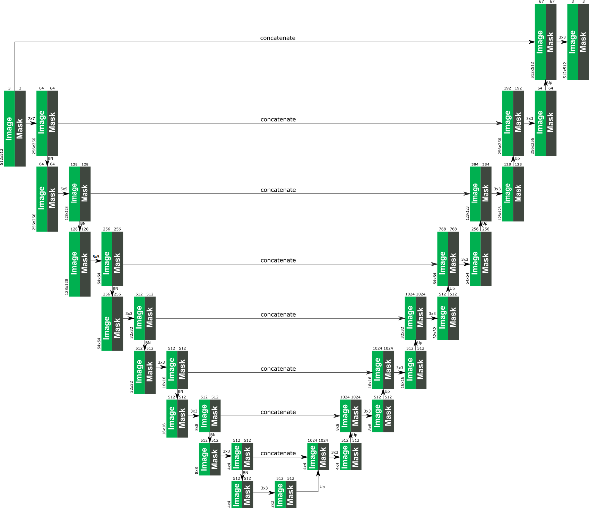
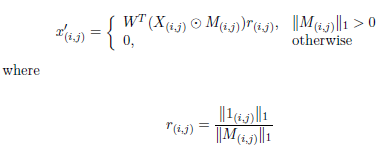

# Reconstruction of Occluded Text in Images for Optical Character Recognition

Text occlusion is among the most intractable obstacles for the task of Optical
Character Recognition (OCR) in Computer Vision. A typical example
is when some characters of a text in an image are invisible due to occlusion
them by arbitrary geometrical shapes. This causes distorting the text and
missing some characters in the word because the holes arise in the image. It
requires finding a method to reconstruct the image by filling in holes with
plausible imagery before recognizing the whole text in an image. I introduce
an approach to reconstruct an image by using Partial Convolution,
which comprises a mask and renormalized convolution operation followed
by a mask-update step to automatically generate an updated mask for the
next layer as part of the forward pass. The Experiments have shown that the proposed model can effectively and reasonably produce reconstructed images 

# Dependencies
  - Python 3.6
  - Keras 2.2.4
  - Tensorflow 1.13
  - OpenCV and NumPy
  - Matplotlib
  - Pandas
  
# The Proposed Model
The structure of the proposed model is based on [U-Net network](https://arxiv.org/abs/1505.04597), which
is based on encoder-decoder architecture. However, instead of using normal
convolutional operation, the network uses stacked partial convolution
operation and mask updating steps, which together form a Partial Convolutional
Layer to perform image reconstruction.

### Network Architecture
The network architecture is illustrated in figure below The network is similar to U-Net architecture 
but with some modifications to fit our task. 
It consists of an encoder and decoder with replacing all convolutional layers with Partial Convolutional 
Layers that take into account also masks and using nearest neighbor up-sampling in the decoding stage. 
The straightforward implementation is to define binary masks of size C x H x W, and the same size with 
their associated images. Mask updating is implemented using a fixed convolution layer with the same 
kernel size (filter size) as the partial convolution operation, but with weights identically set 
to 1 and bias set to 0.

### Partial Convolutional Layer
Partial Convolutional Layer comprises a masked and renormalized Convolution
Operation followed by a mask-update step. Our partial convolutional
layer is a simple convolution but before
doing the convolution we are multiplying the input patch of image with a
binary mask. So, everywhere where the mask is, we are setting the pixels to
zeros (Figure below) and then we are doing the convolution.

We refer to partial convolution operation and mask update function
jointly as the [Partial Convolutional Layer](https://arxiv.org/abs/1804.07723).
Let X be the feature values of
input image (pixel values) for the current convolution (sliding) window at
the position (i,j) and M(i,j) be the corresponding binary mask, with the
hole region being 0 and non-hole region being 1. The partial convolution
(ignoring bias) at every location is similarly defined as:

⊙ denotes element-wise multiplication. 

One more important thing is that the mask
is also updated after each partial convolution operation. If the convolution
was able to condition its output on at least one valid input value, then we
mark that location to be valid. In other words, if we could in one layer reconstruct
some pixels, when receptive field was covering some real pixels in
the place of previous layer not the mask, then we are able to calculate some
activations, and thus we are updating this removing mask from this pixel.
The mask updating function is expressed as:

We are considering the reconstructed information in the subsequent layers.
And thus, with sufficient successive applications of the partial convolution
layer any mask will be shrinking from layer to layer and eventually be
all ones if the input contained any valid pixels, then it usually disappears in
the encoder part.

### Loss Function 

To optimize the model parameters we need a loss function. The used loss function
is composed of many components: 

- Hole and Non-hole per Pixel Loss: 
  here we consider two elements; one is calculated inside the mask and the other for unmasked regions.
  
- Perceptual loss: 
  It looks at 2 images first the ground truth (original) image and second is the output image, it extracts some features based on imageNet pretrained VGG-16 for comparing higher-level feature of these two images.
  
 - Style loss: 
   Similar to perceptual loss looks at ground truth image and output image, but here we perform autocorrelation using some gram matrix on each feature map.

- Total Variation loss: 
  It is a kind of a penalty for non-smooth output in the masked region. 

The Total Loss is a weighted sum of all theses loss components.

# Experiment

### Training Dataset
For all experiments i use [COCO-Text dataset](https://rrc.cvc.uab.es/?ch=5), which is based on MSCOCO dataset that
contains images of complex scenes and based on real scene imagery (as opposed to synthetic images).

### Mask Generation 

I create masks of random streaks and holes of arbitrary shapes using OpenCV as figure shows below, where during the
training phase i do augmentation on the masks and later perform random dilation, rotation
and cropping. All the masks and images for training and testing are with
the size of 512×512.
